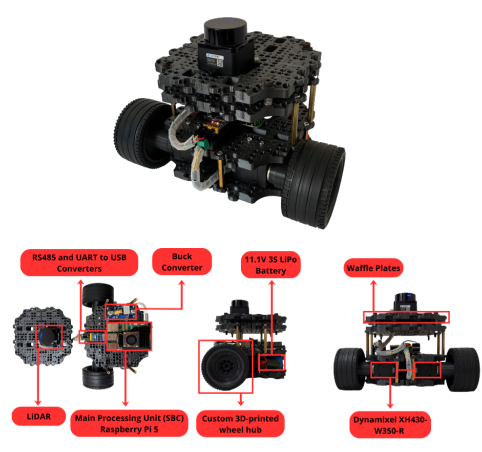
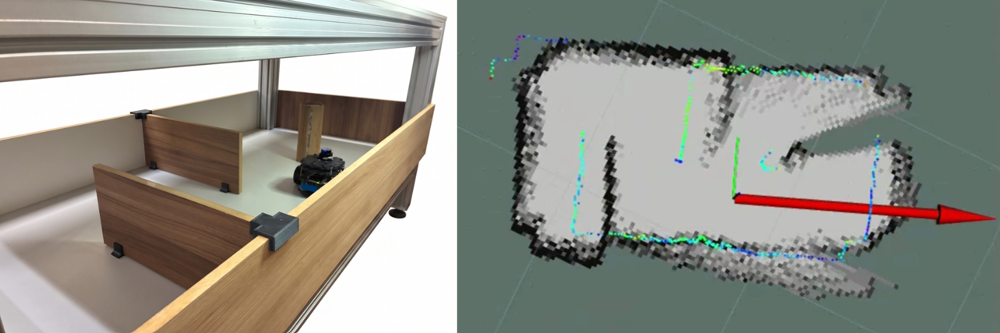
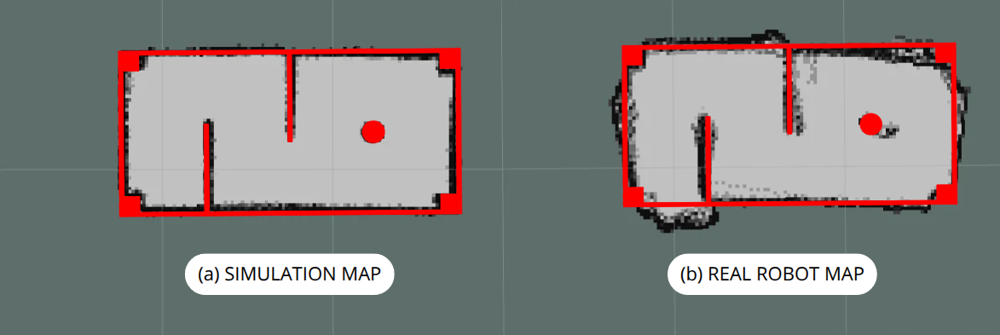

# SLAM Thesis: FastSLAM Implementation in ROS 2

This repository contains the source code for a custom FastSLAM algorithm developed in ROS 2 Humble. It was created as part of a final undergraduate project (TCC) in Control and Automation Engineering at the Federal University of Rio Grande do Sul (UFRGS). 

The primary objective of this project is to provide a foundational, open-source SLAM codebase for the Starchê robotics team, bridging the gap between probabilistic robotics theory and real-world deployment.

## Hardware and 3D Models

The algorithm was validated both in a Gazebo simulation and on a physical DIY TurtleBot3 Burger platform. The custom structural modifications, including the sensor leveling bed and wheel hubs, were manufactured using 3D printing.

Detailed instructions on how this physical robot was constructed, including hardware selection, electrical routing, and electronic integration, are fully documented in the **`TCC_SLAM.pdf`** file included in this repository. This allows anyone to easily replicate and build the exact same DIY robot.

* **Build Instructions & Theory:** See `TCC_SLAM.pdf`
* **3D Printed Parts:** [Download on Thingiverse](https://www.thingiverse.com/thing:7369630)

## Software Architecture Overview

The system is built on a hybrid architecture designed for performance and accessibility. The core SLAM node is written in C++ to handle the heavy computational load of the particle filter and occupancy grid mapping. Meanwhile, complementary nodes—such as the Human-Machine Interface (HMI), autonomous path planning, and low-level hardware control—are written in Python. 

The software supports three operational modes without requiring changes to the core code:
1. **Physical Robot:** Live data from the real hardware sensors.
2. **Simulation:** Virtual data generated by the Gazebo physics engine.
3. **Recorded Data:** Offline execution using historical `.db3` Rosbag files.

## Mapping Results

The FastSLAM algorithm was tested in both a virtual environment and a real-world physical arena to ensure an accurate sim-to-real transition.

**Gazebo Simulation Run:**

**Physical Robot Run:**

**Quantitative Evaluation:**
By superimposing the generated occupancy grids over the ground truth CAD floor plan, we can directly measure the structural accuracy of the FastSLAM implementation.

## Key Features

* **FastSLAM Core (C++):** Implementation of a Rao-Blackwellized Particle Filter. Each particle maintains its own trajectory hypothesis and an independent Occupancy Grid Map.
* **Probabilistic Models:** * *Motion Model:* Processes differential drive odometry and injects tunable Gaussian noise ($\alpha_1$ through $\alpha_4$).
  * *Measurement Model:* Evaluates LiDAR scans using a Likelihood Field approach with dynamic local neighborhood search.
* **Autonomous Navigation (Python):** A state-machine node (`simple_path`) that executes predefined geometric trajectories (straight lines and arcs) to ensure comprehensive mapping coverage.
* **HMI Control Station:** A PyQt5 graphical interface that orchestrates Docker containers, compiles ROS 2 workspaces, and allows real-time tuning of the SLAM parameters.

## Installation and Setup

### Prerequisites
* **Operating System:** Ubuntu 22.04 (Native or via Docker)
* **Framework:** ROS 2 Humble Hawksbill
* **Language:** C++17 and Python 3.10+
* **Python Dependencies:** `matplotlib`, `numpy`, `scipy`, `PyQt5`, `dynamixel_sdk`
